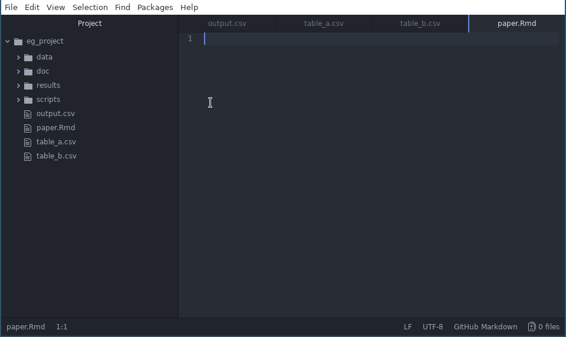

# Command Line Basics

In this session will introduce the command line as a general concept and learn a few commands that are complimentary to git. 

## Overview
* **Teaching**: 30 min
* **Exercises**: 15 min

### Questions
* What is the shell, command line, or terminal?
* Why do I need to know the command line to use git?
* How do I use the command line?
* What commands do I need to know?

### Objectives
* Understand for to form file paths and navigate directories
* Understand how arguments and flags are used to modify command line commands.
* Understand the concept of wild cards '*'.

## Introduction

git is fundamentally a command line tool. Although there are many graphical user
interfaces that can simplify its use, none contain the full set of features available on the command line.

If you ever encounter trouble with a git repository, or need to find out how to
do something important with it, you will invariably stumble across help in the
form of command line instructions. This is why comfort with the command line is
essential for learning git.

## Shell, command line, cli, terminal

All these words in the title above are used interchangeably to mean the same
thing: a sparse window, usually with a dark backgroud and light text, featuring
a prompt followed by a cursor. In the movies hacking computers often
involves people typing really fast into this window.

The command line interface (cli), is a text-based interface to a computer
program. Pretty much everyone primarily uses a Graphical User Interface (GUI) to
interact with their programs, but historically this is only recent. Most of the
time we've had with computers has been using text-based interfaces and often the
GUI can only access a subset of functionality available on the cli. There are
many important programs that only have a cli (e.g. pandoc).

'Terminal' is short for 'terminal emulator' which is to say it is a program
which emulates a physical input and display device called a terminal, that used
to connect to a mainframe computer in the early days of computing. It is the
program that draws the dark background, light text, and cursor.

A 'shell' is a program that provides a cli to your operating system. Think of
the functionality your operating system provides: manipulating your file system,
running and stopping programs, changing system settings etc. All of this can be
done via text with a shell. When you 'open a terminal' the program that the
terminal is talking to initially is a shell. For a given operating system you
often have a choice of many shells. The most popular shell is the 'Bourne Again
Shell' or 'bash'.

## File system navigation

### Listing files and folders

We're jumping in! Windows users, run the `gitbash` program now. MacOS and Linux
users open a fresh terminal.

First lets consider what we can see. Usually your terminal will greet you with a
prompt that looks like this:

```
miles@miles-macbook:~$
```

On Windows it will contain the same elements but look like this:

```
miles@miles-pc MINGW64 ~
$
```

Followed by a cursor. Type the command `pwd`, for 'print working directory', and
hit enter. This will show us the folder in your file system the shell is
currently looking. It should return text to the terminal like so:

```
miles@miles-macbook:~$ pwd
/home/miles
miles@miles-macbook:~$
```

The output can be interpreted like so:

```
/ --            # Root of directory structure 
   | 
   home --      # Home folder
        | 
        miles  # user's individual home folder - working directory
```

Now here's a new command: `ls` will **list** the contents of the working
directory. Run that command and you will see the contents of your home folder.

But `ls` is much more versatile than this. We can use things called 'flags' and
'arguments' to interface with `ls`'s additional features. For example we can
list the contents of our Documents folder like so:

```
miles@miles-macbook:~$ ls Documents
acp_3d-1.png  _cert.png  parchemnt_pix2.xcf
rock_opera.png  the_log.txt  uluru.jpg
miles@miles-macbook:~$ 
```

'Documents' is an **argument** to the `ls` command. We pass commands arguments
by typing them after the command name.

We can view hidden files using the flag `-a` for 'all'. Do that for the working
directory like so:

```
miles@miles-macbook:~$ ls -a
```

Are there more hidden files and folders than you expected? What do you notice
about their file names?

A flag distinct from an argument in that a flag is a constant not a variable. If
a flag is present it 'switches on' certain behaviour. There are two forms:
'--word' and '-a'.

Multiple single letter flags can be combined after a single dash. We can
instruct `ls` to 'list **all** in a **long** format, readable for **humans**'
with:

```
miles@miles-macbook:~$ ls -alh
total 428K
drwxr-xr-x 36 miles miles 4.0K Oct 18 15:01 .
drwxr-xr-x  3 root  root  4.0K Jul 30 21:14 ..
-rw-------  1 miles miles  19K Oct 18 01:29 .bash_history
-rw-r--r--  1 miles miles  220 Jul 30 21:14 .bash_logout
-rw-r--r--  1 miles miles 3.6K Oct 17 21:37 .bashrc
-rw-r--r--  1 miles miles  16K Oct 17 21:34 .bashrc.swp
drwxr-xr-x  2 miles miles 4.0K Oct 16 19:49 bin
drwxr-xr-x 12 miles miles 4.0K Oct 17 21:46 .cache
drwxr-xr-x  4 miles miles 4.0K Aug 31 22:31 code
drwx------ 23 miles miles 4.0K Oct 18 00:30 .config
drwxr-xr-x  2 miles miles 4.0K Jul 30 21:16 Desktop

```


#### Combining arguments and flags {.exercise}

In this exercise you will figure out how to use arguments and flags together.

1. Using the flags you've seen so far, experiment to determine what order the
   flags have to be in.
2. Create a command that lists all the contents of your 'Documents' folder in
   long format.

#### One flag to rule them all {.exercise}

Most commands can give you useage information about what kinds of flags and
arguments they support if you call them with the flag `--help`, sometimes `-h`
will work also.

Answer the following:

2. Obtain the usage information for `ls`. What is a flag that you can use to
   arrange the output in alphabetical order?
1. By convention flags that are full words use a double dash `--` and flags are
   a single letter have a singe dash. Why must this be the case?

### Moving between folders

The command `cd` **changes** the working **directory**. To use it type `cd`
followed by an argument which is the path of the folder to change to. The path
can be either 'absolute' or 'relative'. For example, assuming the current
working directory is the user's home (`/home/miles`), to change directory to
their Downloads we could do either of these:

```
miles@miles-macbook:~$ cd Downloads
miles@miles-macbook:~/Downloads$ 

miles@miles-macbook:~$ cd /home/miles/Downloads
miles@miles-macbook:~/Downloads$ 
```

A path that starts with `/` is assumed to be absolute. Paths that do not are
assumed to be relative to the current working directory.

Notice how the prompt has changed to reflect the new working directory. The `~`
symbol is a shorthand for the user's home directory and we can use it to form
paths.

#### Changing Challenges {.exercise}
1. You should be in your Downloads folder. Change to your Documents folder in a
   single command incorporating the `~` in the path.
1. Change to the root folder of the system and list its contents. Change to your
   home folder.

### Pathing shortcuts
Apart from `~` there are two other symbols with special meanings in paths:

`.` is shorthand for 'the current working directory'. So this won't change
anywhere:

```
miles@miles-macbook:~$ cd .
``` 

and these are equivalent:

```
miles@miles-macbook:~$ cd ./Downloads

miles@miles-macbook:~$ cd Downloads
```

`..` is shorthand for 'the parent of the current working directory'. It can be
used multiple times so, `cd ..` would move up one folder and `cd ../..` would
move up two. It is useful for creating relative paths to other branches of a
directory tree e.g.:

```
miles@miles-macbook:~$ cd ~
miles@miles-macbook:~$ cd Downloads
miles@miles-macbook:~/Downloads$ cd ../Documents
miles@miles-macbook:~/Documents$ 
```

We moved 'sideways' to a folder at the same level.

#### Do Dot Dot {.exercise}

1. Where does the following command place you on your system? How does it work?

```
cd ~/../../..
```

## Manipulating the Filesystem

The shell provides commands to create, move, and delete folders and files. 

### Creating Folders
Let' create an example project folder from the command line:

First we'll use the `mkdir` command to **make** a **directory**. The argument to
the command is the path of the directory to be created. To create a
directory in the current folder we just need to use its name since and the path
is assumed to be relative.

```
miles@miles-macbook:~$ mkdir eg_project
```

Confirm the project folder exists using `ls` and change into it with `cd`:


```
miles@miles-macbook:~$ ls
miles@miles-macbook:~$ cd eg_project
```

Then we'll create several more folders as if the project is an analysis, `mkdir`
can create multiple directories at once, for each argument passed.

```
mkdir doc data results scripts
```

### Moving Folders/Files

Using Atom we'll create some empty files. To open our project use **File**
-> **Open Folder...** and select the 'eg_project' folder.

Create the 4 files in the `eg_project` folder as shown:



They don't need to contain anything. 

Let's say we want to move the .Rmd file to the scripts folder. We can use the `mv` command to **move** files or folders. `mv` takes two arguments, the first being files or folders to move and
the second being the path to move then to. Our command would look like:

```
miles@pa00120549:~/eg_project$ mv paper.rmd scripts
```

Let's say we don't like the name 'scripts' since 'paper.Rmd' is not really a
script - it's a source file. We can also use `mv` to rename files and folders, by
moving them to a new place in the file system e.g.:

```
miles@pa00120549:~/eg_project$ mv scripts src
```

#### Rename a file {.exercise}

Complete the command below to rename the 'paper.Rmd' file to 'methods.Rmd' using `mv`:

```
miles@pa00120549:~/eg_project$ mv src/paper.Rmd ...
```

Be sure to check your result using `ls`.

### Wildcards and Manipulations

Now we're going to see how we can use wildcards to perform actions on many
files or folders at once. A wildcard is the the `*` symbol, and it can be used to provide file system arguments that match patterns. 

For example, lets say we want to list all the data files in the current folder:

```
miles@pa00120549:~/eg_project$ ls -alh *csv
```

This lists all files that end in 'csv'. We could also use it a the end of a path
to match all items that start with a prefix, e.g. also folders starting with 'd':

```
miles@pa00120549:~/eg_project$ ls -alh d*
```

We can use this with all types of file manipulations!

#### Move a group {.exercise}
1. Using a single `mv` command, move the csv files with 'table' in the name to the 'data' folder.

### File Removal

The `rm` command can be used to **remove** files and folders. It takes the path of
the files or folders as its argument. It requires the `-r` (**recursive**) flag
to remove folders.

To remove the 'doc' folder we'd do:

```
miles@pa00120549:~/eg_project$ rm -r doc
```

#### Wildcard extermination {.exercise}

1. Combine the `rm` command with two wildcards to remove all .csv files in our
   project with a single command.

*Hint:* You can use a wildcard in the path for both the folder and file name portion.

## Summary
In this lesson we've:

* Demystified some of the jargon associated with the command line.
* Learned the anatomy of cli commands: paths, arguments, and flags.
* Learned about relative and absolute paths, including useful short hands (`~`, `..`, `.`)
* Seen wildcards in action.
* Learned a handful of shell commands.

This is but a tiny fraction of what is available using the shell. The main
objective here was to communicate some ideas that come in handy with git. You
might like to see: http://swcarpentry.github.io/shell-novice/ for a more
complete introduction.`
