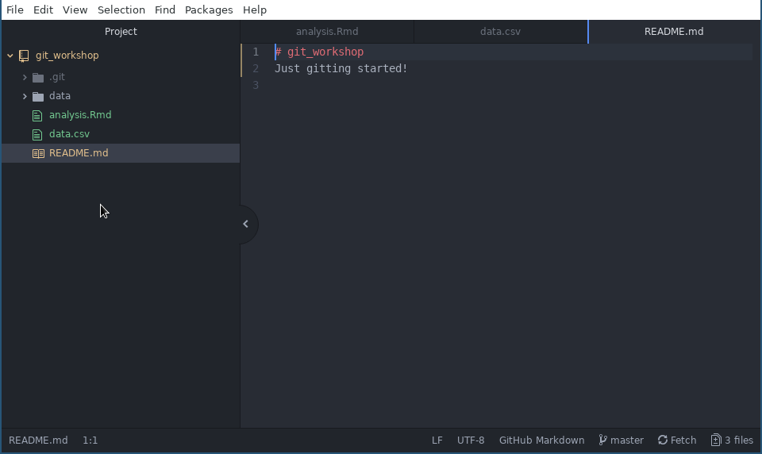

# Using a git repository

**Teaching**: X min
**Exercises**: X min

## Questions
* How do I get a local copy of my repository?
* How do I record changes to my files using git?
* How do I view the status of the repository?
* How do I syncronise the history with GitHub?

## Objectives
* Understand the PC configuration required to use a git repository 
* Understand how to create a local copy of a GitHub repository.
* Understand the conceptual areas: working tree, staging area
* Understand the basic update workflow: add to staging, commit with message, push to origin

## Local git configuration
Before we can use git we need to give it some personal information. Every committed change to a repository requires the author's name and email as metadata. We register this information using the git cli.

### Configure your git user information {.exercise}

1. Open your terminal, or gitbash or Windows.
1. Use these commands to register your name and email address, making sure it's the same email address you registered with GitHub:

```
$ git config --global user.email your.email@example.com
$ git config --global user.name "Firstname Lastname"
```

You can check the value of this configuration by running the same command with no value argument:

e.g.

```
$ git config --global user.email
```

### Configure your text editor {.exercises}

The text editor you configure here is the one git will open so you can write
messages that explain your changes. Ideally it is an editor that
opens really fast or one you always have open. 

The default editor, Vim, is often found to be difficult to use by beginners and is
the subject of [numerous memes](https://stackoverflow.blog/2017/05/23/stack-overflow-helping-one-million-developers-exit-vim/). In this course we will use Atom, which we
will have open most of the time. You can change this at a later stage.

Configure it like so:

```
$ git config --global core.editor "atom --wait"
```

A list of configurations for other popular editors can be found
[here](http://swcarpentry.github.io/git-novice/02-setup/index.HTML).

## Anatomy of git cli commands

All git commands we will learn share elements with those you have just seen.
They will all begin with `git` followed immediately by an argument that defines
the type of command you would like git to perform. In the above example the
command is `config`. Flags, both `-` and `--` types are used to alter the way
the command is performed. Finally there are additional arguments that are
required to perform the command.

In the example above the first argument is the configuration key, and the second
argument is the value it should take. The `--global` flag makes the
configuration global, so it will apply to all repositories. Without `--global`
the configuration applies to only the repository in the current working
directory (In our case there is no such repository).

In summary, the form is:

```
$ git <command> <command flags> <command arguments>
```

### How to git help

Like other cli programs we've seen we can get help with `--help`. This can be
done in the context of git the program or a single command i.e.:

```
$ git --help
$ git config --help
```

Help for a specific command will open up a help browser in the terminal, you can
scroll with the arrow key or by paging, and quit with 'q'.

#### Escape from 

## Cloning a repository

Cloning is the process of creating a local copy of a remote repository, like one
hosted on GitHub. Before we clone a repository, think about where you will
clone it to. You might like to create yourself a `repos` folder in your home
folder. 

To clone a repository use the `clone` command followed by 2 arguments:

```
$ git clone <repository URL> <parent folder>
```

The parent folder is the folder that will contain your repository contents. The
folder must be empty or the command will abort. If you leave the parent folder
blank, the default behaviour is to create a folder for the repository in the
current working directory with the same name as the repository. This is helpful
and common usage.

### Create a repos folder (optional) {.exercise}
1. Use the `mkdir` command to create a folder called 'repos' in your home folder (`~`)

### Clone your repository {.exercise}
In your browser:

1. navigate to your 'git_workshop' repository on GitHub
  1. Click the green 'Clone or Download' button on the right of screen.
  1. Use the clipboard icon to copy your repository's URL.

In your terminal:

1. Change to the folder that will house your repositories with `cd`.
  1. Use this command to clone your respository, with your URL pasted in for '<URL>':
  ```
  $ git clone <URL>
  ```
  1. Enter your GitHub password when prompted and press enter.

Here is some sample output:

```
miles@miles-macbook:~/repos$ git clone https://www.github.com/milesmcbain/git_workshop.git
Cloning into 'git_workshop'...
remote: Enumerating objects: 3, done.
remote: Counting objects: 100% (3/3), done.
remote: Total 3 (delta 0), reused 0 (delta 0), pack-reused 0
Unpacking objects: 100% (3/3), done.
```

### What makes a git repository?

If you `cd` into your repository folder and run the `ls -a` command you will see
a hidden folder called '.git'. Have a look at its contents if you like. This is
where git stores all the metadata it needs to operate your repository, including
the complete history of every file ever added.

Be careful not to delete or rename the '.git' folder or your repository will no
longer work with git.

## Local repository workflow

At a high level the workflow for working with your repository is:

1. Create, update, or delete local files.
1. Move changes to the staging area.
1. Commit changes in the staging area to the repository history.
1. Push commits to the upstream remote.

There's a bit of specific terminology here we can break down:

You make changes to files in the repository as you normally would with any file
on your computer. Those changes are saved on your computer but they are not
recorded in your repository until they are **committed**. A **commit** is a
record of related (usually) changes with associated metadata about like author,
time, date, and reason for change. 

A commit is not a snapshot. It is a delta. Only what changed is recorded.
Therefore a single commit is not enough to recover a repository. You need all
commits in order. You can think of a repository as a timeline of commits. This
timeline is commonly referred to as the **history**.

The **staging area** is a conceptual area where you can place changes you plan
to commit imminently. You might have made many changes for varying reasons, so
it makes sense to group them into commits related to the reason. You place files
to be committed together in the staging area which feeds into your next commit.

As you make commits, your local repository moves ahead of the remote repository
(GitHub). You **push** your new commits to the remote to bring its history up to the
present state of your local repository.

## Status - determining when things have changed

The `status` command gives us useful information about the status of our work
relative to the local repository history and remote repository.

It can be run with no additional arguments or flags. It will search upward from
the current working directory until it find a git repository or fails. If we run
it from within our freshly cloned repository we get:

```
$ git status
On branch master
Your branch is up-to-date with 'origin/master'.
nothing to commit, working tree clean
```

Which tells us: 

  * our local branch
  * our repository status with respect to our remote branch history
  * if we have uncommitted changes in the repository file structure (the
    **working tree**).

### Aside: branches

You can think of branches as parallel timelines in your repository history.
We'll discuss these later, time permitting, but for now all you need to know is
that when you create and clone a repository from GitHub its history contains
only one timeline: a **branch** called **master**.

### Introducing changes

Now we'll introduce some changes and see how the status changes. Let's do the
following:

1. Create a new folder called 'data' in our repository with `mkdir`
2. Create a new file in the repository called 'analysis.Rmd' with Atom
2. Create a new file in the repository called 'data.csv' with Atom.
3. Add the following text on a new line in README.md: "Just gitting going!"

This is what Atom should look like when we're done:



Running `git status` again should produce different output along the lines of:

```
$ git status
On branch master
Your branch is up-to-date with 'origin/master'.
Changes not staged for commit:
  (use "git add <file>..." to update what will be committed)
  (use "git checkout -- <file>..." to discard changes in working directory)

	modified:   README.md

Untracked files:
  (use "git add <file>..." to include in what will be committed)

	analysis.Rmd
    data.csv

no changes added to commit (use "git add" and/or "git commit -a")
```

Some things of note: 

* Our master branch is still up-to-date with the remote repository branch
  'origin/maser' - no commits have been made.
* git is suggesting commands we could use from here: `add`, `checkout`, and `commit`.
* git has detected README.md was modified.
* git has detected a new untracked files: analysis.Rmd, data.csv.
* git has **not** detected our new folder: 'data'. Git tracks changes to files only.

## Add - moving changes to staging

The `add` command moves changed files to the staging area in preparation for a
commit. The syntax is:

```
$ git add <pathspec>
```

Where the `<pathspec>` argument is a path to file or folder. In the case of a
folder, all files in the folder will be added to staging. Paths can be formed
using wildcards, '*', and short-hands e.g. '.' - This comes in quite handy for
staging groups of files.

`add` can be used to add stage an existing file the repository knows about or an
entirely new file like 'analysis.Rmd' in the previous section. The syntax is the
same.

### Stage all files in a single command {.exercise}

1. Using a single `git add` command add stage 'analysis.Rmd', 'README.md', and 'data.csv'.

*Hint:* `git add --help` might have something useful to say regarding the
`<pathspec>` argument.

### Types of files to stage

There are some considerations when staging files:

* Once a file is committed it is very hard to remove from the history.
  * Beware committing sensitive information like security tokens.
* Git works best with files that are 'human readable', i.e. source files.
  * binary files or media files cannot be 'diffed' to work out delta.
* GitHub has individual file size limit of 100 MB

## Reset - unstaging changes

Git `reset` is a powerful command that is used in the context of undoing things
we have done locally before pushing. It can reset the staging area and also
reset where we are on our history timeline to a point in the past, allowing
history to be rewritten.

Time travelling and changing history is generally a bad idea and in the worst
case [can lead to a time paradox, the result of which could cause a chain reaction
that would unravel the very fabric of the space-time continuum and destroy the
entire universe!](https://www.imdb.com/title/tt0096874/quotes/qt0426656)

We will just consider the basic usage for resetting staging in this section. The syntax is:

```
$ git reset <path>
```

To unstage files or folders on the path specified by the `<path>` argument.
Unstaging everything at once is also an option by omitting `<path>`:

```
$ git reset
```

### Born for the stage {.exercise}

We made a mistake and should move 'data.csv' to the data folder!

1. Unstage 'data.csv' with `git reset`
2. Move 'data.csv' to the 'data' folder with `mv`
3. `add` 'data.csv' to staging in its new location.

### Caution: --hard

It is likely in your travels with git that you will be at some stage advised to
do `git reset --hard` to resolve a problem. The `--hard` flag will result in all
changes being unstaged **and additionally all tracked files being reset to their
last committed state**. Clearly there is a risk of work loss. Make sure you
don't want to keep anything before you do this!

## Commit - recording staged changes

## Push - sending commits to GitHub

## To Teach
* `git clone`
* git config --global user.name, user.email, core.editor
* git status
* git add, git add *.ext
* git reset (to remove files from staging)
* git commit, commit -m
* git push
