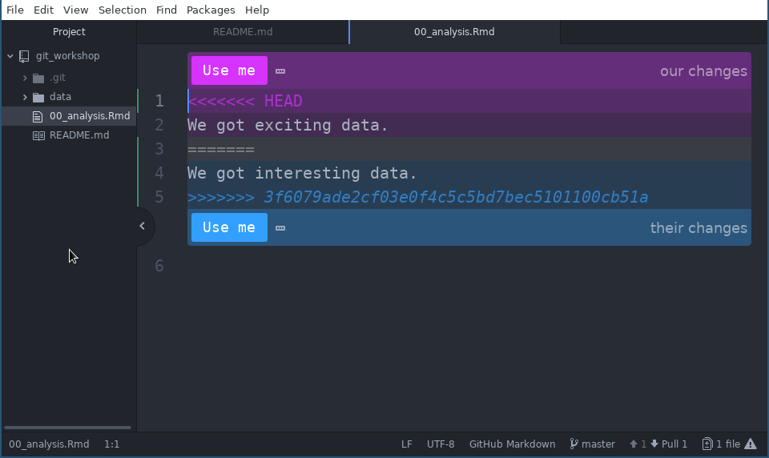

# Distributed Workflow

* **Teaching**: 35 min
* **Exercises**: 10 min

## Questions
* How do I bring down commits I pushed to GitHub at work to my home PC, or vice versa?
* What happens when files on GitHub conflict with what I have committed locally? 

## Objectives
* Understand how to pull down commits pushed on another computer to my local copy.
* Understand what a merge conflict is and how to resolve it using information provided by git.

## You: your most annoying collaborator

An advantage of syncing with the cloud (GitHub) is that you can clone your
repository onto multiple computers and use the remote repository to keep all the
local copies in sync.

This workflow requires one new commands and some understanding of what
can go wrong.

### Simulate another computer

We can simulate another computer in the mix by creating a second local copy of
your repository on your current computer.

#### Clone a second local copy {.exercise}

1. In your browser, get the url for your repository.
1. In you terminal, use the `git clone` command to clone your repository to a
   new folder with the name 'other_git_workshop'
  - The form of the command will be `git clone <URL> <Path to folder>`
1. Use `ls` to check everything looks correct.

Note: You didn't clone one repository inside the other DID you? Use `mv` to fix.

#### Outcome

To be clear you should now have 2 local copies:

  * 'git_workshop' - the one we initially cloned in a previous lesson.
  * 'other_git_workshop' - the one we just cloned, simulating a copy on a second
    computer.
  
Both of these reference the same GitHub repository.
  
## Simplest case: Pulling commits pushed from elsewhere

We use the `git pull` command to pull commits from the remote repository to a
local copy. The most common usage is without any additional arguments or flags.
Similarly to `push`, they exist but it is likely you will never use them.

To see how push works we have to commit and push some changes in
`other_git_workshop`. Do this:

1. In your terminal, call git clone wit your username for `YOURUSER`:

    `$ git clone http://www.github.com/YOURUSER/git_workshop other_git_workshop`
  
1. Change into the 'other_git_workshop' folder with `cd`
1. In Atom, add a line to '00_analysis.Rmd' that says 'We got data.'
1. In your terminal, stage the change to '00_analysis.Rmd' with `git add`
1. Commit the change to '00_analysis.Rmd' with `git commit` using an informative
   commit message.
1. Push your commit with `git push`

### Refreshing repository status

Now let's see what the status of the 'git_workshop' repository is:

1. Change into the `git_workshop` folder with `cd`
1. Call `git status`

The output will look like this:

```
On branch master
Your branch is up-to-date with 'origin/master'.
nothing to commit, working tree clean

```

WAT? We just pushed commits to the remote repository but `status` is saying
we're up to date? It turns out that `status` is considers whether we are up to
date with the last **known** version of the repository history, which we got
when we pushed last. `status` does not contact the remote to see if anything new
has changed.

We can explicitly contact the repository with a command called fetch:

```
$ git fetch
remote: Enumerating objects: 5, done.
remote: Counting objects: 100% (5/5), done.
remote: Compressing objects: 100% (2/2), done.
remote: Total 3 (delta 0), reused 3 (delta 0), pack-reused 0
Unpacking objects: 100% (3/3), done.
From https://www.github.com/milesmcbain/git_workshop
   3ff91b0..ef6c217  master     -> origin/master
```

Now if we call git status we should see:

```
$ git status
On branch master
Your branch is behind 'origin/master' by 1 commit, and can be fast-forwarded.
  (use "git pull" to update your local branch)
nothing to commit, working tree clean

```

We see now we are behind the remote by 1 commit. Apparently we can be
fast-forwarded. A fast-forward means our branch can have the new commits from
the remote repository merged into its history by just inserting them after the
old history. It's git's way of telling us there's no problems it needs a human
to sort out.

### Pulling

We do not need to `fetch` before we run the pull command. If we run the `pull`
command and no new work exists it nothing will happen.

If we run the `git pull` command we will get the work that was comitted and
pushed in `other_git_workshop`:

```
$ git pull
Updating 3ff91b0..ef6c217
Fast-forward
 00_analysis.Rmd | 1 +
 1 file changed, 1 insertion(+)
```

### Happy Pull Workflow

We can avoid issues if we always run the pull command as our first action when
doing work. If we are working without collaborators, there can never be a
conflict between the local copy and the remote, because we always build on the
latest work committed to the remote and pulled to our local copy.

The two things you can do to create problems are:

  * forgetting to pull and making commits
  * forgetting to push so when you do remember to pull next you get no new work.
  
Forgetting is inevitable, don't be too hard on yourself if it happens and don't
panic. Git was built with conflict resolution in mind. The situation can be
resolved and you won't lose work.

## Resolving a merge conflict

We will simulate a situation where you forgot to pull existing remote commits,
and made new commits locally.

### Adding remote commits

1. Change into the 'other_git_workshop' folder with `cd`
1. In Atom, Change the first line in '00_analysis.Rmd' to say 'We got interesting data.'
1. In your terminal, stage the change to '00_analysis.Rmd' with `git add`
1. Commit the change to '00_analysis.Rmd' with `git commit` using an informative
   commit message.
1. Push your commit with `git push`

The push should succeed.

### Add local commits

1. Change into the 'git_workshop' folder with `cd`
1. In Atom, Change the first line in '00_analysis.Rmd' to say 'We got exciting data.'
1. In your terminal, stage the change to '00_analysis.Rmd' with `git add`
1. Commit the change to '00_analysis.Rmd' with `git commit` using an informative
   commit message.
1. Push your commit with `git push`

The push fails with:

```
$ git push
To http://www.github.com/milesmcbain/git_workshop
 ! [rejected]        master -> master (fetch first)
error: failed to push some refs to 'http://www.github.com/milesmcbain/git_workshop'
hint: Updates were rejected because the remote contains work that you do
hint: not have locally. This is usually caused by another repository pushing
hint: to the same ref. You may want to first integrate the remote changes
hint: (e.g., 'git pull ...') before pushing again.
hint: See the 'Note about fast-forwards' in 'git push --help' for details.
```
So we take git's hint and call `git pull` which says:

```
$ git pull
remote: Enumerating objects: 5, done.
remote: Counting objects: 100% (5/5), done.
remote: Compressing objects: 100% (2/2), done.
remote: Total 3 (delta 0), reused 3 (delta 0), pack-reused 0
Unpacking objects: 100% (3/3), done.
From http://www.github.com/milesmcbain/git_workshop
   ef6c217..923cb03  master     -> origin/master
Auto-merging 00_analysis.Rmd
CONFLICT (content): Merge conflict in 00_analysis.Rmd
Automatic merge failed; fix conflicts and then commit the result.

```

CONFLICT(!). Git tells us the file with the problem. This happened because both
changes affected the same line. Git is asking us to 'fix merge conflicts and
commit the result'.

### Fixing merge conflicts

When a merge conflict happens git will place some markup inside the file to
assist with resolving a conflict. Atom will see this and create a dialogue. If
we check the contents of 'git_workshop/00_analysis.Rmd' in Atom we should see:



We resolve the conflict by clicking 'Use me' on the one we want to keep. In this
case let's choose the pink 'our changes'. Now:

1. Save the file in Atom.
1. In the terminal, stage the file with `git add`.
1. Commit the file with git `commit`

Notice how git has automatically added information to the commit message:

```
Merge branch 'master' of https://www.github.com/milesmcbain/git_workshop

# Conflicts:
#       00_analysis.Rmd
#
# It looks like you may be committing a merge.
# If this is not correct, please remove the file
#       .git/MERGE_HEAD
# and try again.


# Please enter the commit message for your changes. Lines starting
# with '#' will be ignored, and an empty message aborts the commit.
# On branch master
```
 
Leave the message unchanged, save and close the file to complete the commit.
This type of commit is called a 'merge commit'.

Now all that is left:

1. push the merge commit with `git push`.
1. change to the `other_git_workshop` folder and pull the merge commit with `git
   pull`

The pull will succeed and the repositories are now both in sync with GitHub.
Check this if you like.

### Merging without Atom fanciness

You can get rid off the merge assistance in Atom by right clicking on the
conflict and selecting 'dismiss'. In plain text the conflict markup looks like
this:

```
<<<<<<< HEAD
We got exciting data.
=======
We got interesting data.
>>>>>>> 3f6079ade2cf03e0f4c5c5bd7bec5101100cb51a
```

To understand this you need one new piece of information: **HEAD** is a 
reference which refers to the last commit on the current local branch, so HEAD
is the last thing we committed to master. The other really long ugly string is
the full hash of the commit on the remote.

So to resolve the conflict in plain text, we delete the fencing and replace the
section with the text that we wish to use. Importantly, the text can:

* Use either version
* Use both versions
* Use neither version and contain completely new content.

For example a valid way to resolve this conflict would be:

```
We got exciting data,
We got interesting data.
```

We'd save, stage and commit that and git would accept it as resolving the
conflict.

#### Manual Merge {.exercise}

* In the same fashion as our example engineer a conflict by changing the same line in:
  - 'other_git_workshop/00_analysis.Rmd'
  - 'git_workshop/00_analysis.Rmd'

* Commit and push one before committing and pushing the other.
* This time resolve the conflicted file in plain text by dismissing the atom merge help (right click 'dismiss').

## Using merge tools

Many git GUI applications have powerful features for resolving merge conflicts
quickly and painlessly. At the time of writing some of the best are:

* [GitKraken](https://www.gitkraken.com/)
* [Sublime Merge](https://www.sublimemerge.com)
* [Meld](http://meldmerge.org/)

## Summary

You learned key tools for working in a distributed way by yourself

* git pull
* resolving merge conflicts
